# Team Members
- [Coby Preza](https://cobypreza.github.io/)
- [Dexter Chung](https://dexter-chung.github.io/)
- [Enoch Pangaribuan](https://enochpangaribuan.github.io/)
- [Jacob Maier](https://jacobamaier.github.io/)

# Organization
[Organization Link](https://github.com/hoops-hawaii)

# Team Contract

[Contract Link](https://docs.google.com/document/d/1_U7_7owckecTq5K04KJOTmJ5TSI1bj0xP_n2OeRlH_s/edit?tab=t.0)

# Milestone 1

[M1 Project page](https://github.com/orgs/hoops-hawaii/projects/3/views/6)

# Milestone 2

[M2 Project page](https://github.com/orgs/hoops-hawaii/projects/9)

# Milestone 3
[M3 Project page](https://github.com/orgs/hoops-hawaii/projects/10)

# Deployment

[Hoops Hawaii](https://hoops-hawaii-nextjs.vercel.app/)

# Overview

## The Problem 

There are many individuals who have a strong passion for basketball. Of those individuals there are also many who have a desire to discover and play on new courts and with new people. However, existing map-based applications provide only basic location information and fail to address the specific needs of a baller. A true baller wants to know the condition of the court, how many people are present at the court, the type of people who play at the court, etc. No one wants to arrive at a court disappointed to see that there’s no one there, the court is dirty, and the lights went out in the area. 

## The Solution

This project introduces a centralized database designed specifically for these passionate basketball players and assists in finding new courts and opportunities to play. The platform enables users to efficiently discover courts providing information such as condition, player count, availability, etc. That way the user can make an informed decision on where to go take their hoop endeavors next. 

# Approach

Hoops Hawaii will have two roles: `User` and `Admin`.

## Users

Regular users will be able to browse and explore the court database to explore places around Manoa to play. They are able to maintain a personalized list of “home” courts and check in to the courts they want to play at while also viewing real-time court activity. Additionally, users can interact with other players in the area, up-keeping personal profiles, and create a sense of community through the love of basketball.

## Admins

Administrators are responsible for managing court-related information. This includes the ability to add courts, update existing court details, and remove outdated courts. By enabling these operations, this ensures that the database is up-to-date and well-kept for the regular user to enjoy.

## Landing Page
This is the page that the users are welcomed to when they first click the link to our website.
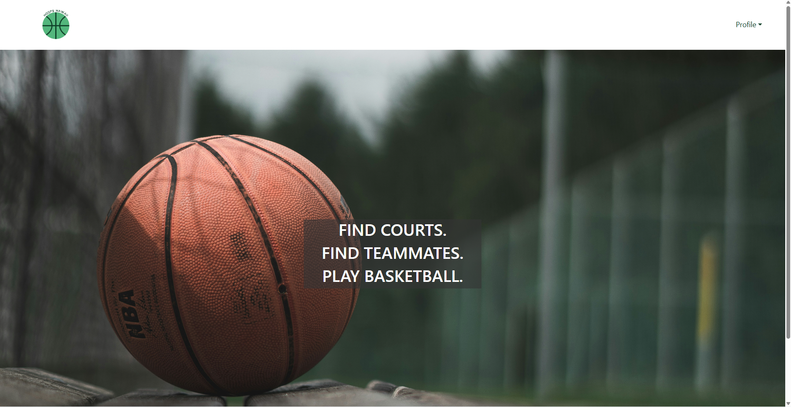

## Sign In Page
Users are asked to sign in to their account.
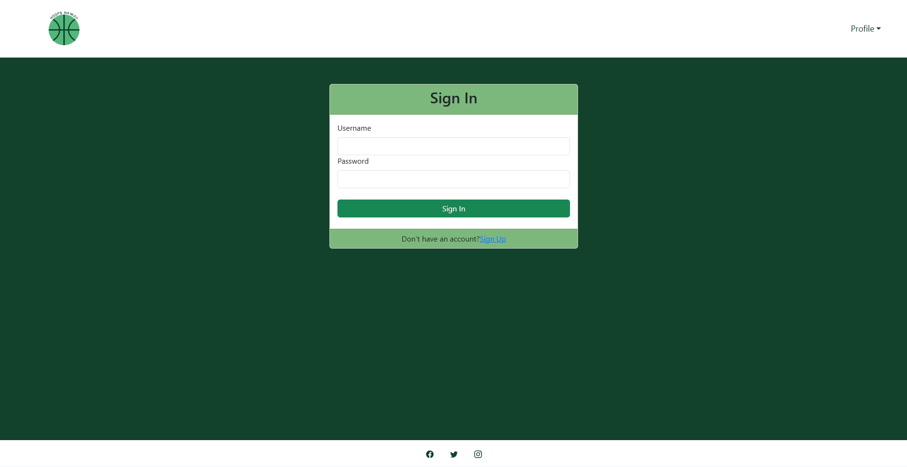

## Sign Up Page
If the user does not have an account, they may sign up through this page.
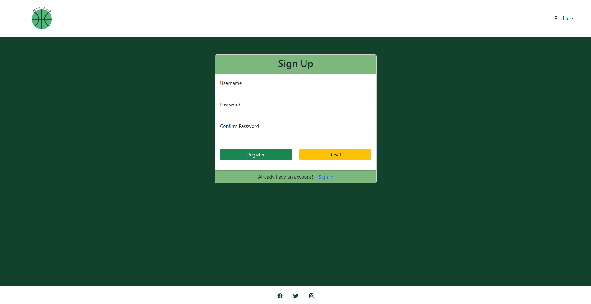

## Sign Out Page
This is what it looks like to sign out of your account.
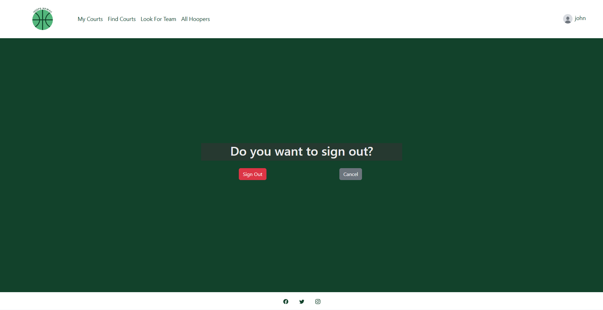

## My Courts Page
This is where your saved courts go. This is also where you can check into your court and save your primary Home Court.
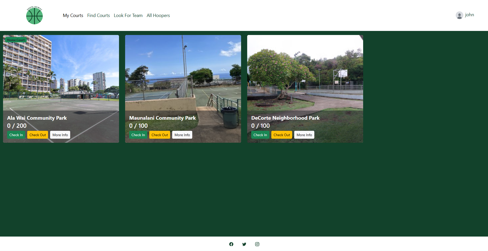

## Find Courts Page
This is where you can find courts you want to go to and save them to add to your My Courts Page.
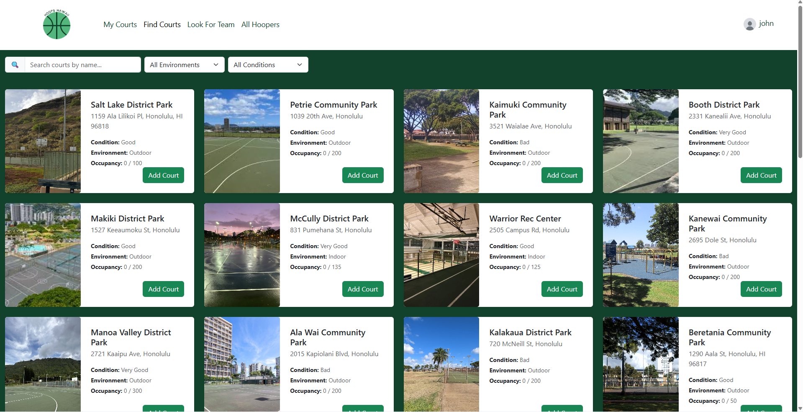

## Look For Team Page
This is where you can go to find other players to team up with.
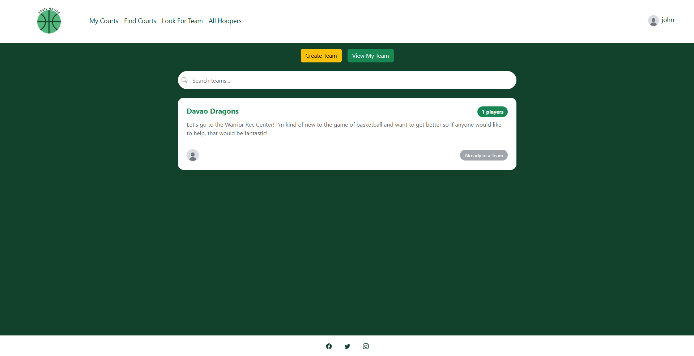

## Team Create Page
This is the form to create your team.
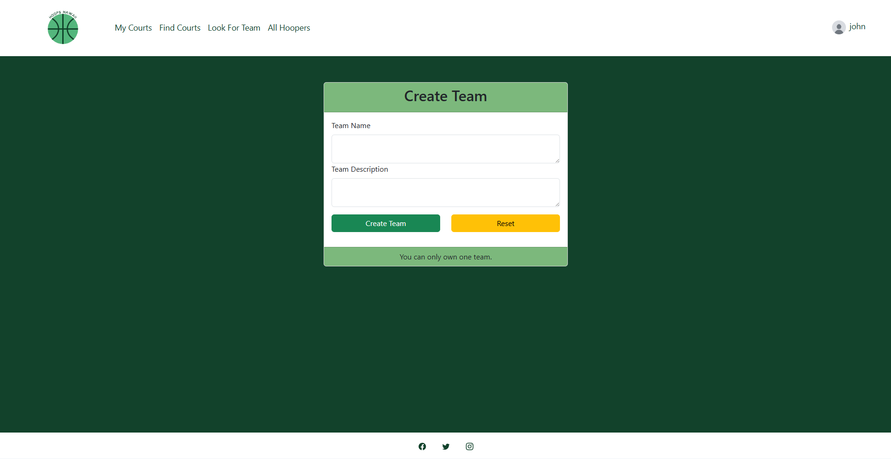

## View Teammates Page
This is the form where you can see all the other people who joined your team.
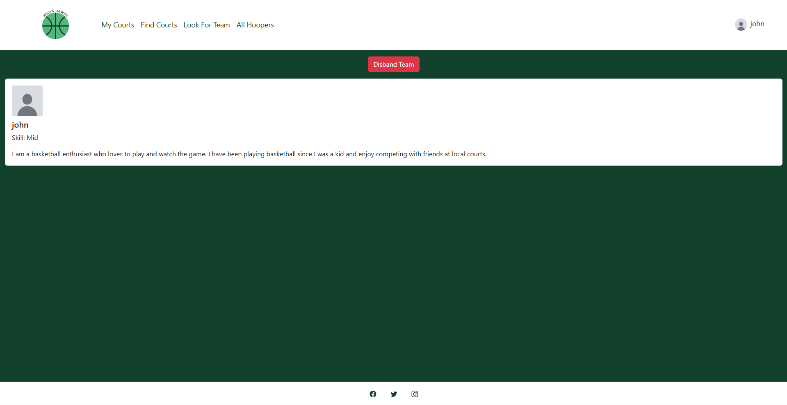

## All Hoopers
This is where you can find other hoopers across the site.
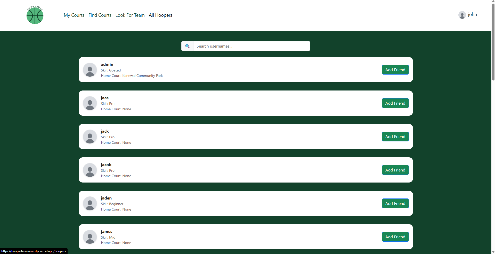

## Add Court Page
This is a page only visible to admins. It allows them to add courts to the database.
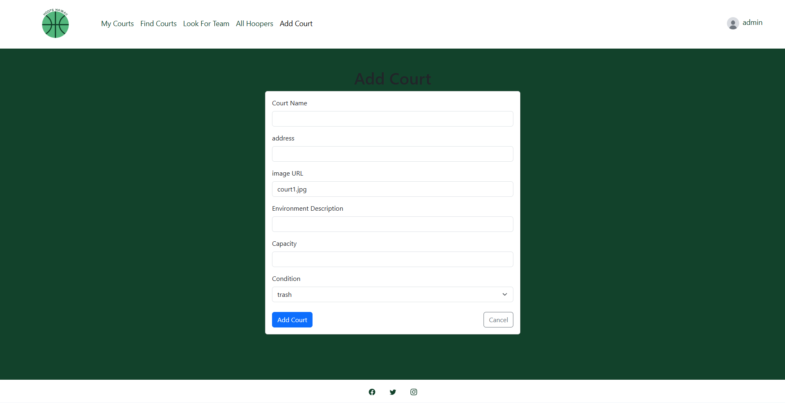

## View Profile
This is your profile page.
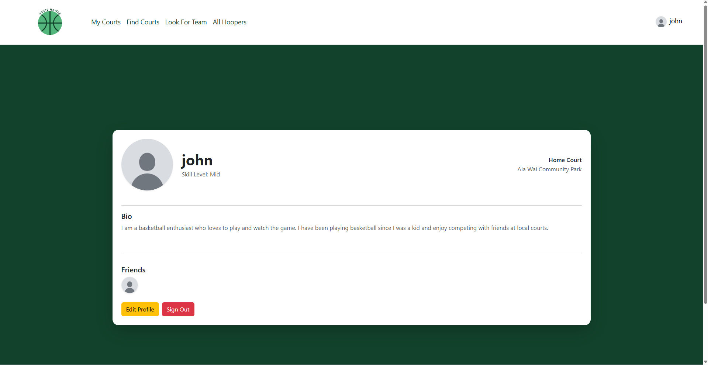

## Edit Profile
This is a form to update your profile page.
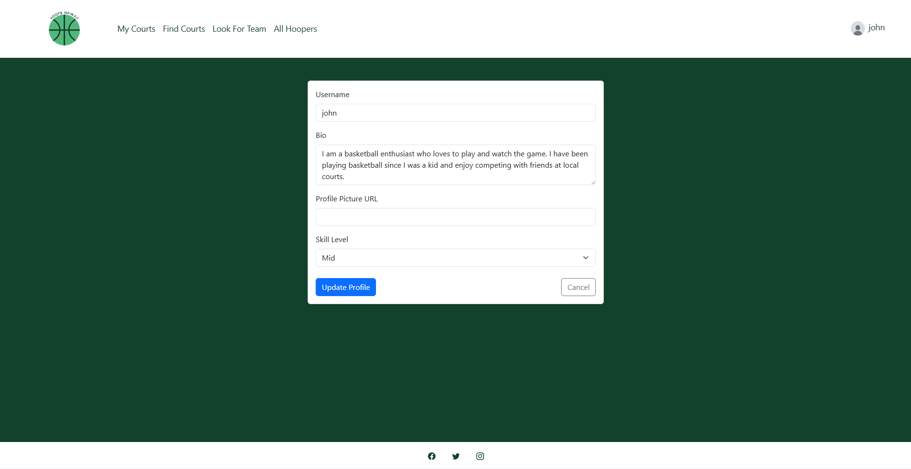

# User Guide
- Users begin their experience on the `Landing Page`, where they are introduced to the application and its purpose
- From there, users log in through the `Log In Page` or register through the `Sign Up Page`
- Once logged in, users are directed to the `List Courts Page`, which serves as the central hub for discovering available basketball courts where they can find detailed information about each court
- When they find a court to play at they may want to find some other people to play with so they go to the `Looking For Team Page` to connect with others in the area interested in playing
- To look more appealing to these other players the user might edit their `Profile` to seem more interesting

# User Feedback
1. The page looks really nice. I play basketball myself, and think it's a great idea. I do think there should be a rating system though, it gives hoopers a better insight on how playing at the courts is actually like.
2. The website UI is nice, I do think there can be more done to the All Hoopers and Look For Team pages, it looks kind of bland. More pictures might be a nice addition as well to give something for users to look at.
3. I think the logo you guys made is super cool. I think the font could be changed, it does look kind of bland and almost default-y in a way.
4. Maybe add a chat system later. I find it cool that you can connect, but if you are looking to join a team, it would be cool if you can talk to them instead of going in blindly.
5. I would eventually add a filter for the My Courts page. I can imagine that there might be situations where someone has a lot of courts that they go to, whether it be often or sometimes. If they end up having too much, then they would just have to keep scrolling until they get to the court they want to go to. 

# Developer Guide

## Clone Respository
Here is the [link](https://github.com/hoops-hawaii/hoops-hawaii-nextjs) to our respository

## Installing Dependencies
`npm install`

## Setting Up Database
- `npx prisma generate`
- `npx prisma migrate dev`
- `npm run seed`

## Run Development Server

`npm run dev`

Once the command is entered it can be seen at [http://localhost:3000](http://localhost:3000)
