# Hoops-Hawaii

# Team Members
- [Coby Preza](https://cobypreza.github.io/)
- [Dexter Chung](https://dexter-chung.github.io/)
- [Enoch Pangaribuan](https://enochpangaribuan.github.io/)
- [Jacob Maier](https://jacobamaier.github.io/)

# Team Contract

[Contract Link](https://docs.google.com/document/d/1_U7_7owckecTq5K04KJOTmJ5TSI1bj0xP_n2OeRlH_s/edit?tab=t.0) 

# Overview

## The Problem 

There are many individuals who have a strong passion for basketball. Of those individuals there are also many who have a desire to discover and play on new courts and with new people. However, existing map-based applications provide only basic location information and fail to address the specific needs of a baller. A true baller wants to know the condition of the court, how many people are present at the court, the type of people who play at the court, etc. No one wants to arrive at a court disappointed to see that there’s no one there, the court is dirty, and the lights went out in the area. 

## The Solution

This project introduces a centralized database designed specifically for these passionate basketball players and assists in finding new courts and opportunities to play. The platform enables users to efficiently discover courts providing information such as condition, player count, availability, etc. That way the user can make an informed decision on where to go take their hoop endeavors next. 

# Approach

Hoops Hawaii will have two roles: `User` and `Admin`.

## Users

Regular users will be able to browse and explore the court database to explore places around Manoa to play. They are able to maintain a personalized list of “home” courts and check in to the courts they want to play at while also viewing real-time court activity. Additionally, users can interact with other players in the area, up-keeping personal profiles, and create a sense of community through the love of basketball.

## Admins

Administrators are responsible for managing court-related information. This includes the ability to add courts, update existing court details, and remove outdated courts. By enabling these operations, this ensures that the database is up-to-date and well-kept for the regular user to enjoy.

# Intend to Implement
- Landing Page: When the user clicks on our link, they are welcomed to this page
- List Courts Page: Court database of the UH Manoa area included with information
- Sign Up Page: Allows users to register a new user
- Log In Page: Allows users to sign in to the user you created 
- Looking For Team Page: Allows users to make teams with each other
- Profile Page: Allows users to make personalized hooper profiles
- Create Court Page: Allows only admins to make additional courts to the database

## Landing Page
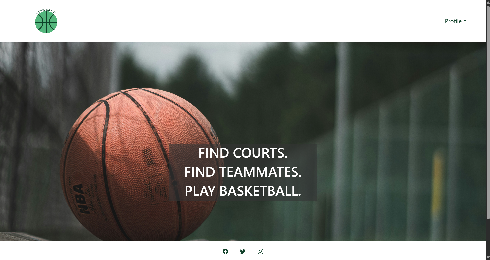

## Sign In Page
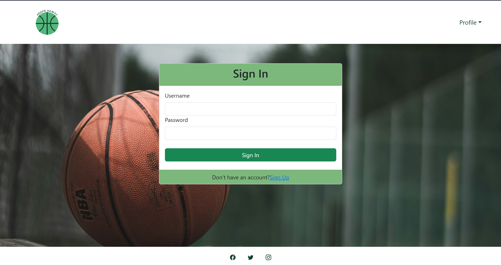

## Sign Up Page
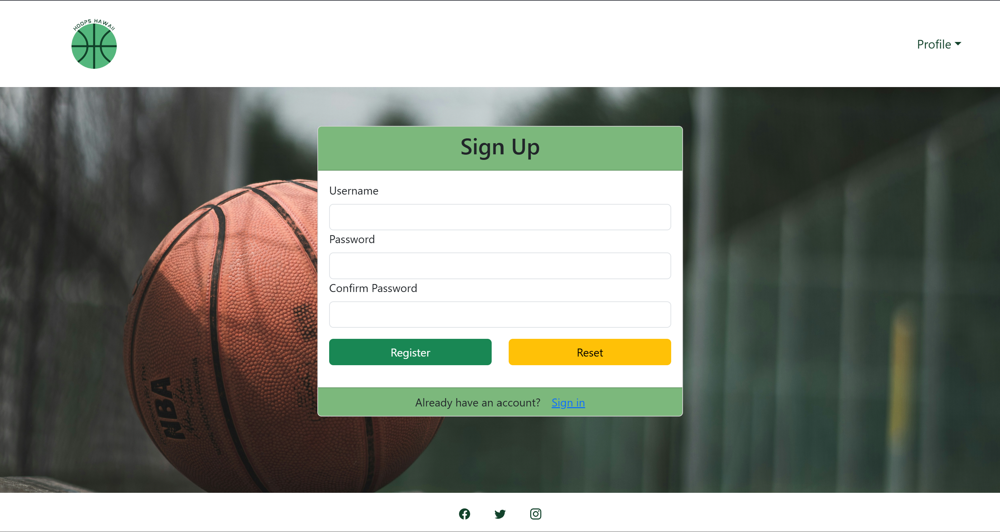

## Sign Out Page
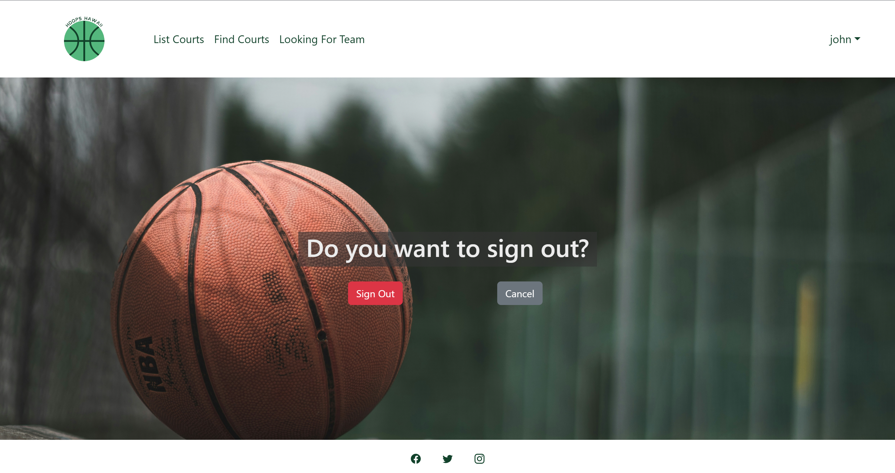

## Mockup List Court Page
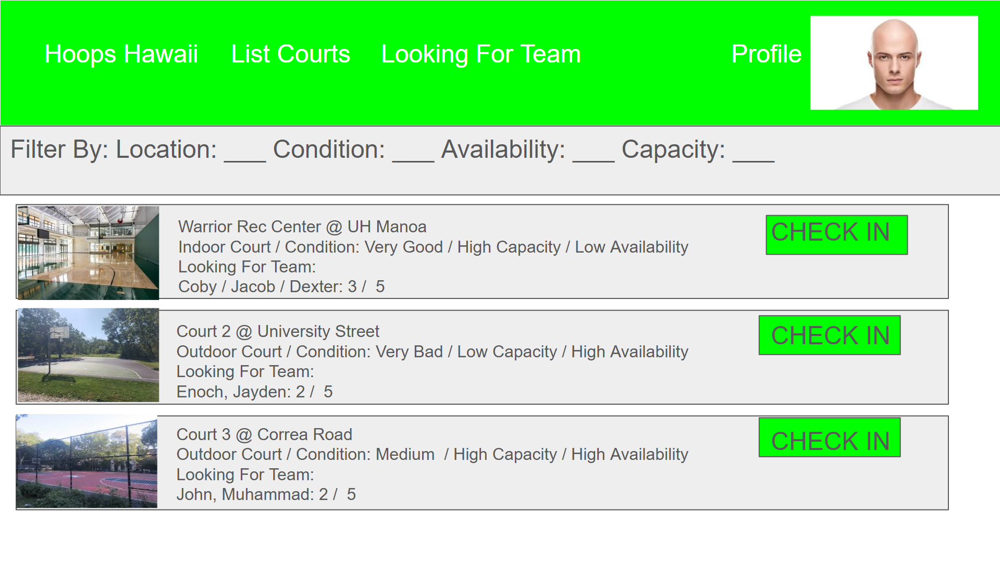

## Mockup Find Court Page
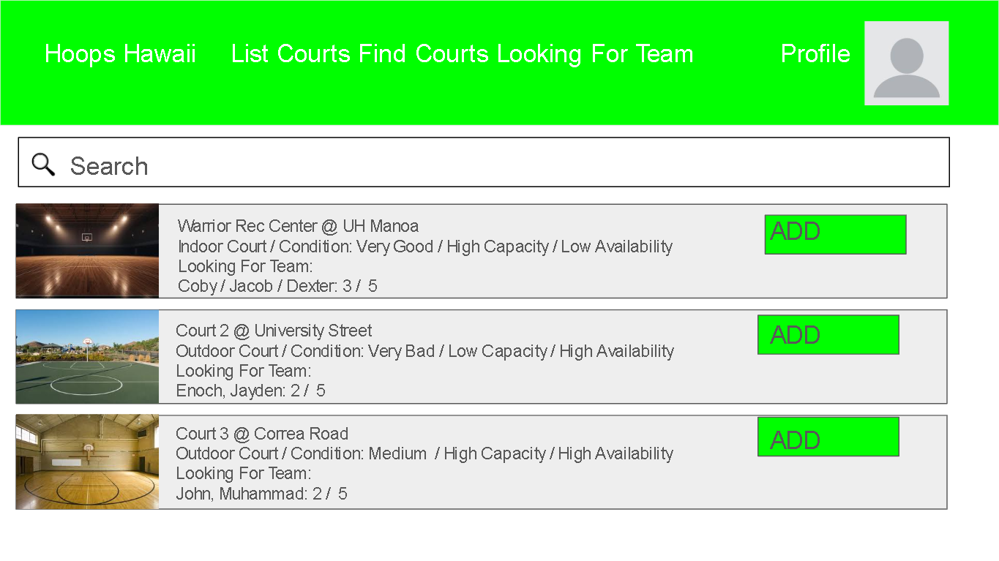

## Team List Page
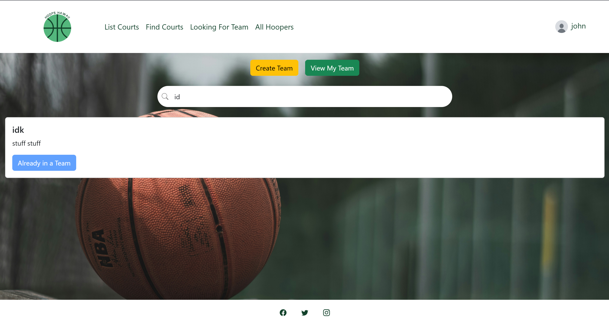

## Team Create Page
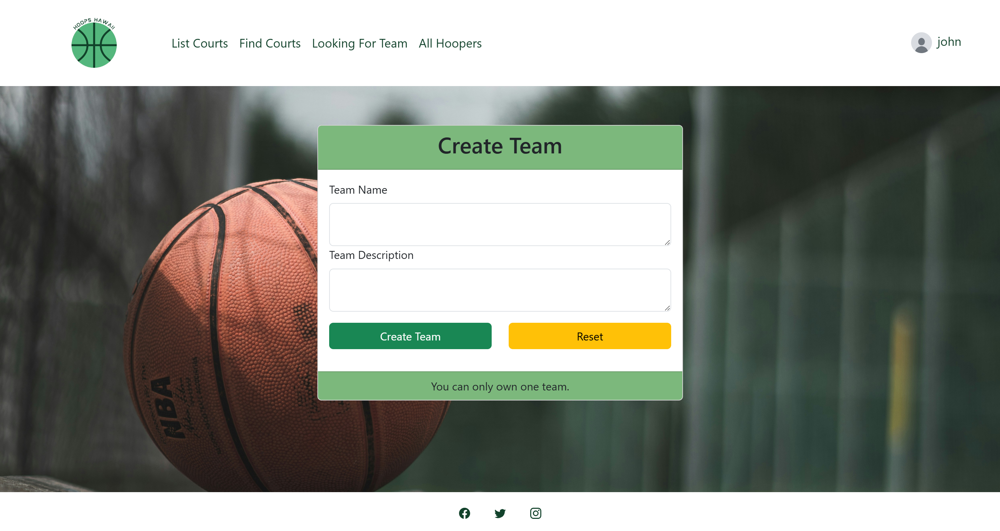

## View Teammates Page
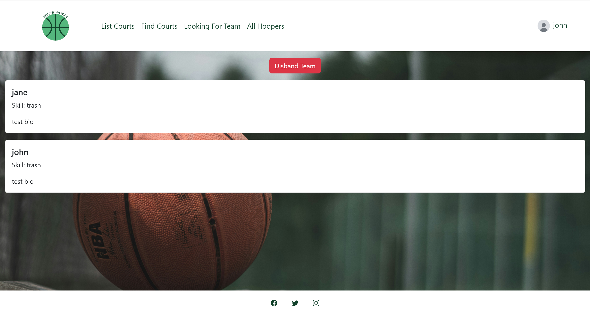

## View Profile
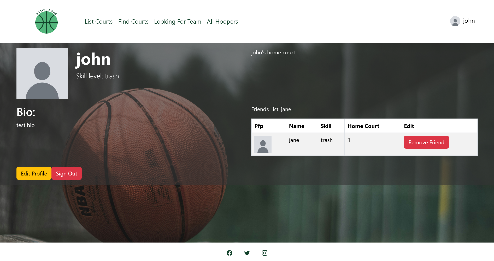

## Update Profile
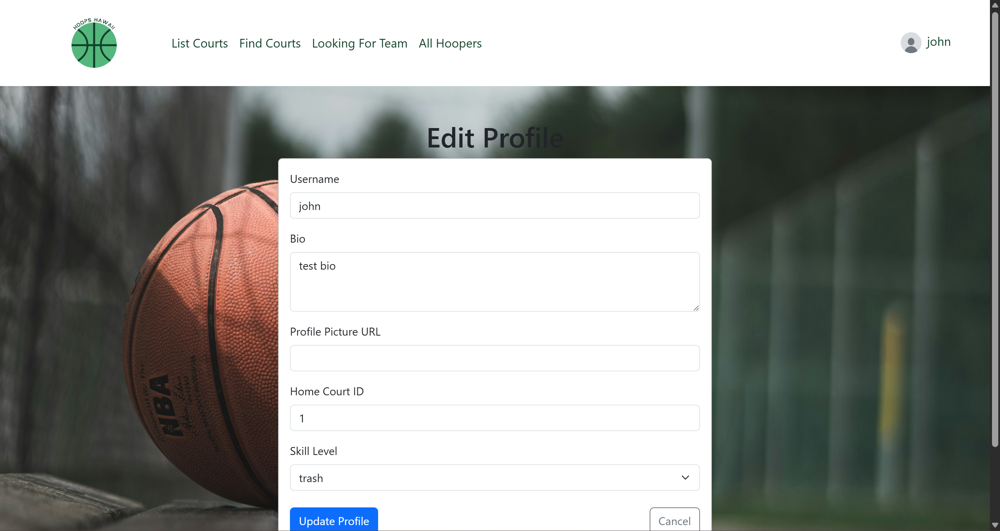

## View Hoopers
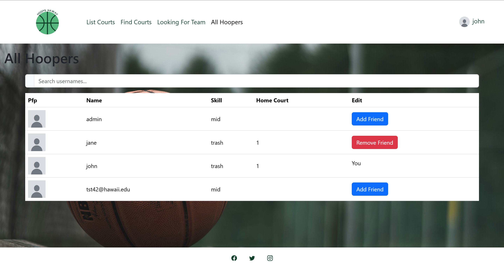

# User Experience
- Users begin their experience on the `Landing Page`, where they are introduced to the application and its purpose
- From there, users log in through the `Log In Page` or register through the `Sign Up Page`
- Once logged in, users are directed to the `List Courts Page`, which serves as the central hub for discovering available basketball courts where they can find detailed information about each court
- When they find a court to play at they may want to find some other people to play with so they go to the `Looking For Team Page` to connect with others in the area interested in playing
- To look more appealing to these other players the user might edit their `Profile` to seem more interesting

# Milestone 1

[M1 Project page](https://github.com/orgs/hoops-hawaii/projects/3/views/6)

# Milestone 2

[M2 Project page](https://github.com/orgs/hoops-hawaii/projects/9)

# Deployment

[Hoops Hawaii](https://hoops-hawaii-nextjs.vercel.app/)
